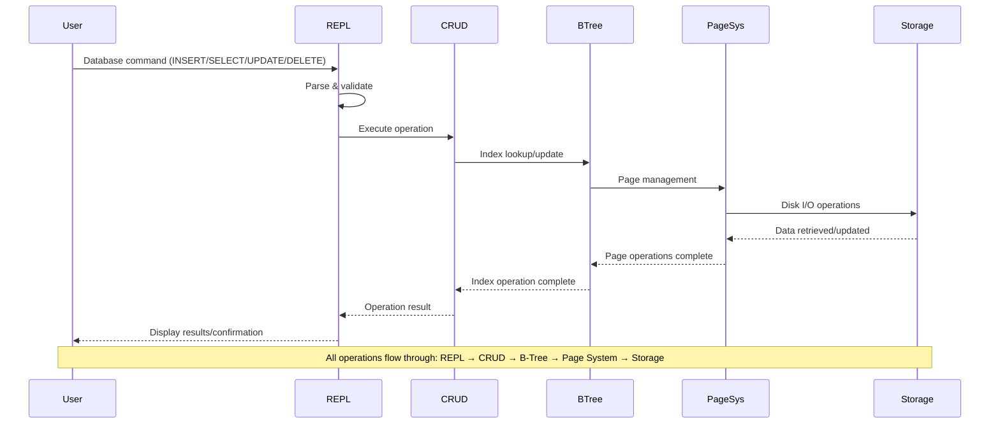

# CoreDB

> ## A minimal disk-based database with B-tree indexing built in C.

## Installation

```sh
# Clone
git clone https://github.com/Adel-Ayoub/coredb.git
cd coredb

# Build
make

# Run the database
./coredb
```

---

## Requirements

- C compiler (GCC/Clang)
- Make

### Dependencies

CoreDB has no external dependencies and uses only standard C libraries for:
- File I/O (`stdio.h`, `unistd.h`)
- Memory management (`stdlib.h`)
- String operations (`string.h`)
- Error handling (`errno.h`)

---

## Usage

```text
CoreDB — interactive disk-based database with B-tree indexing

Usage: ./coredb

CoreDB provides an interactive REPL (Read-Eval-Print Loop) for database operations.
No command-line arguments required - just run and start typing commands.
```

## Operations

### CRUD Commands:

| Operation | Syntax              | Description                |
|-----------|---------------------|----------------------------|
| INSERT    | `INSERT <id> <name>` | Add a new row             |
| SELECT    | `SELECT`            | List all rows             |
| SELECT    | `SELECT <id>`       | Get row by ID             |
| UPDATE    | `UPDATE <id> <name>`| Update row name           |
| DELETE    | `DELETE <id>`       | Remove row by ID          |
| EXIT      | `exit`              | Quit the database         |

### Data Types:

| Field | Type     | Constraints          |
|-------|----------|----------------------|
| ID    | Integer  | Positive, unique     |
| Name  | String   | Max 60 characters    |

---

## Architecture Overview

```text
╔═════════════════════════════════════════════════════════════════════════════════════╗    
║                               DATABASE ARCHITECTURE                                 ║
╠═════════════════════════════════════════════════════════════════════════════════════╣
║                                                                                     ║
║  ┌─────────────────────┐     ┌─────────────────────┐     ┌─────────────────────┐    ║
║  │    REPL Interface   │────▶│   Database Engine   │────▶│    B-Tree Index     │    ║
║  │                     │     │                     │     │                     │    ║
║  │ ┌─────────────────┐ │     │ ┌─────────────────┐ │     │ ┌─────────────────┐ │    ║
║  │ │ • Parse input   │ │     │ │ • Page cache    │ │     │ │ • O(log n) ops  │ │    ║
║  │ │ • Error handling│ │     │ │ • Transactions  │ │     │ │ • 3 reads max   │ │    ║
║  │ │ • Command hist. │ │     │ │ • Memory mgmt   │ │     │ │ • Auto-balance  │ │    ║
║  │ └─────────────────┘ │     │ └─────────────────┘ │     │ └─────────────────┘ │    ║
║  └─────────────────────┘     └─────────────────────┘     └─────────────────────┘    ║
║           │                           │                           │                 ║
║           ▼                           ▼                           ▼                 ║
║  ┌─────────────────────┐     ┌─────────────────────┐     ┌─────────────────────┐    ║
║  │   User Commands     │◀────│     CRUD Ops        │◀────│    Page System      │    ║
║  │                     │     │                     │     │                     │    ║
║  │ ┌─────────────────┐ │     │ ┌─────────────────┐ │     │ ┌─────────────────┐ │    ║
║  │ │ INSERT/SELECT   │ │     │ │ Create/Read/    │ │     │ │ • 4KB pages     │ │    ║
║  │ │ UPDATE/DELETE   │ │     │ │ Update/Delete   │ │     │ │ • Header/Index  │ │    ║
║  │ │                 │ │     │ │                 │ │     │ │ • Data pages    │ │    ║
║  │ └─────────────────┘ │     │ └─────────────────┘ │     │ └─────────────────┘ │    ║
║  └─────────────────────┘     └─────────────────────┘     └─────────────────────┘    ║
║                                       │                                             ║
║                                       ▼                                             ║
║  ╔═══════════════════════════════════════════════════════════════════════════════╗  ║
║  ║                            STORAGE LAYER                                      ║  ║
║  ╠═══════════════════════════════════════════════════════════════════════════════╣  ║
║  ║                                                                               ║  ║
║  ║    ┌─────────────────────────────────────────────────────────────────┐        ║  ║
║  ║    │                        coredb.db                                │        ║  ║
║  ║    │                                                                 │        ║  ║
║  ║    │  ┌───────────────┬───────────────┬───────────────────────────┐  │        ║  ║
║  ║    │  │ Header Page   │ Index Pages   │      Data Pages           │  │        ║  ║
║  ║    │  │   (Root)      │   (B-Tree)    │       (Rows)              │  │        ║  ║
║  ║    │  │               │               │                           │  │        ║  ║
║  ║    │  │ ┌───────────┐ │ ┌───────────┐ │ ┌───────────┬───────────┐ │  │        ║  ║
║  ║    │  │ │ Metadata  │ │ │  B-Tree   │ │ │   Row     │   Row     │ │  │        ║  ║
║  ║    │  │ │ Schema    │ │ │  Nodes    │ │ │   Data    │   Data    │ │  │        ║  ║
║  ║    │  │ │ Config    │ │ │ (≤256     │ │ │ (≤63/pg)  │ (≤63/pg)  │ │  │        ║  ║
║  ║    │  │ │           │ │ │ children) │ │ │           │           │ │  │        ║  ║
║  ║    │  │ └───────────┘ │ └───────────┘ │ └───────────┴───────────┘ │  │        ║  ║
║  ║    │  └───────────────┴───────────────┴───────────────────────────┘  │        ║  ║
║  ║    └─────────────────────────────────────────────────────────────────┘        ║  ║
║  ║                                                                               ║  ║
║  ╚═══════════════════════════════════════════════════════════════════════════════╝  ║
║                                                                                     ║
╚═════════════════════════════════════════════════════════════════════════════════════╝
```
--- 

### Data Flow



### Key Components:

- **B-Tree Index**: Efficient O(log n) lookups with 3 disk reads max
- **Page System**: 4096-byte pages for optimal disk I/O
- **Persistent Storage**: Data survives program restarts
- **Automatic Compaction**: Removes empty pages after deletions

---

## Usage Examples

```bash
# Start the database
./coredb

# Insert some data
db> INSERT 1 Alice
db> INSERT 2 Bob
db> INSERT 3 Charlie

# Query all data
db> SELECT
Row 0: id=1, name=Alice
Row 1: id=2, name=Bob
Row 2: id=3, name=Charlie

# Query specific row
db> SELECT 2
Row: id=2, name=Bob

# Update a row
db> UPDATE 2 Robert
Updated row: id=2, new name=Robert

# Delete a row
db> DELETE 1

# Verify deletion
db> SELECT
Row 0: id=2, name=Robert
Row 1: id=3, name=Charlie

# Exit
db> exit
```

---

## Build & Test

```bash
# Build everything
make

# Run full test suite (30 tests)
make test

# Clean build artifacts
make clean

# Clean everything including test builds
make clean-all
```

### Test Coverage:

-  Basic CRUD operations
-  B-tree indexing efficiency
-  Data persistence across restarts
-  Input validation (negative IDs, duplicates)
-  Page compaction after deletions
-  Memory management and error handling

---

## Performance

- **Lookup**: 3 disk reads maximum (B-tree height)
- **Insert**: 3-4 disk writes with page splitting
- **Delete**: 3-4 disk writes with compaction
- **Storage**: 4096-byte pages for optimal I/O
- **Indexing**: B-tree with configurable key capacity

---

## License

See the [LICENSE](LICENSE) file for details.
